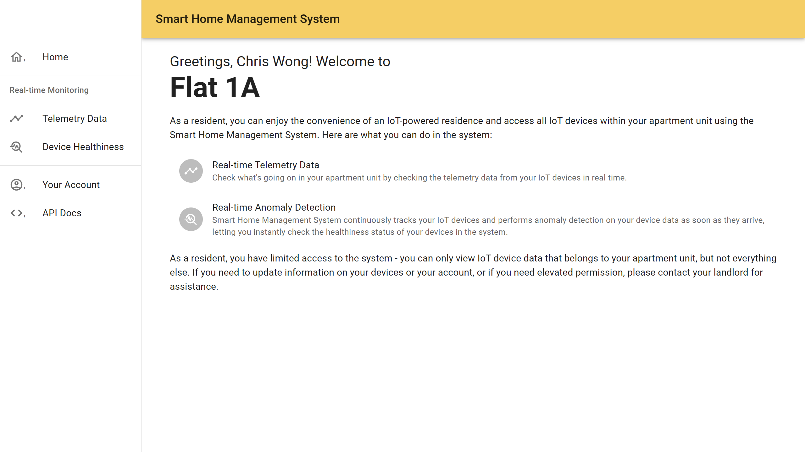

# Smart Home Management System with Real-time Anomaly Detection on Smart Sensor with Machine Learning

**Smart Home Management System** is a cloud-based building management solution for furnished apartment buildings,
allowing the landlord to manage the IoT devices in the system and residents to access IoT devices within the apartment.
Proper authentication and authorization measures are implemented in the system to manage the access of different users.

With real-time anomaly detection on IoT device data using machine learning, the system is able to identify potential
anomaly events in a particular IoT device as data arrives, easing the workload of managing the IoT system.

The system adopts a microservices architecture; all components are containerized, which can be deployed to a Kubernetes
cluster with the help of Helm Chart and Terraform Script.

## Major Features

### Entity Management

Manage the entities in your apartment building in terms of floors, flats, devices and the relationship between them.

*Manage all flats in the apartment buildings*

*View and update device details*

### User Management

You can invite other trusted users to join the system and manage entities in the building by creating a Landlord account for them. In addition, the residents can also access the system, but they only have read-only access to the devices under their flats.

*View and update user account details*

*Web UI for resident users (limited functionality in UI)*

### Real-time Data Visualization

Keep track of the telemetry data produced by all devices in real-time as well as viewing the historical telemetry data.

*Real-time telemetry data for all devices*

### Realtime Anomaly Detection

Smart Home Management System monitors all telemetry data that goes through the system and uses Machine Learning to identify anomalies in real-time. The prediction result for all devices will be immediately visualized.

*Real-time anomaly detection results for all devices*

*Historical anomaly detection result for a particular device*

## Deployment

### On Kubernetes Using Terraform (Recommended)

This is the default approach for running the Smart Home Management System on your computer. Terraform scripts have been
created to deploy all the system components automatically.

You can learn more about the deployment procedure in [this deployment guide](./deployment/terraform/README.md).

### Using Docker Compose

This is provided as an alternative to running the Smart Home Management System on your computer.

You can learn more about the deployment procedure in [this deployment guide](./deployment/docker-compose/README.md)

## Demo Data

Demo data are available during deployment to illustrate the potential use cases of this system. You can learn more about
the demo data [here](./extra-info/DEMO-DATA.md).