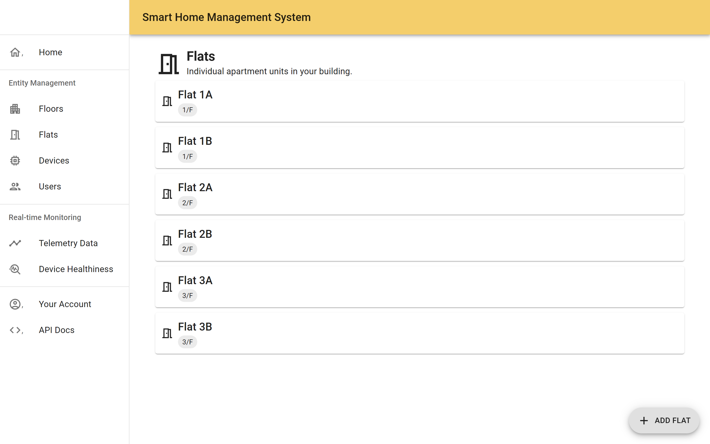
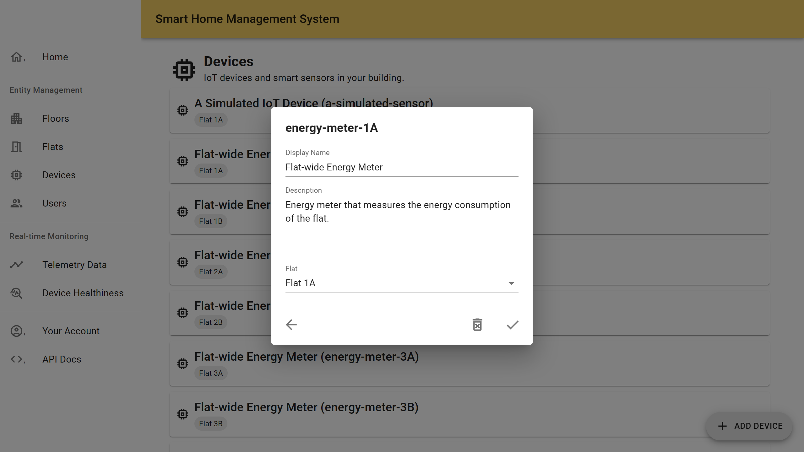
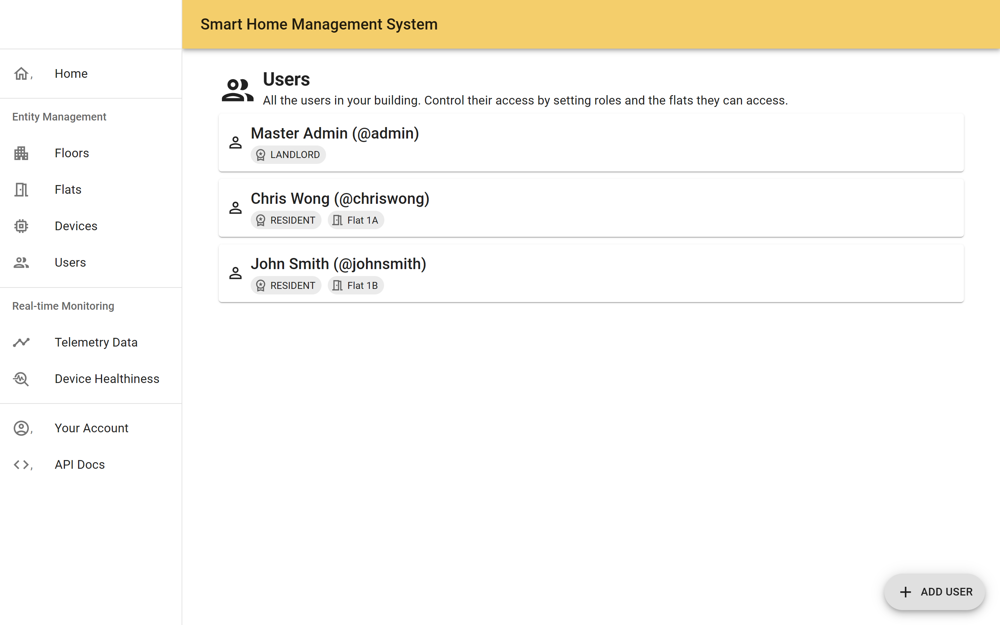
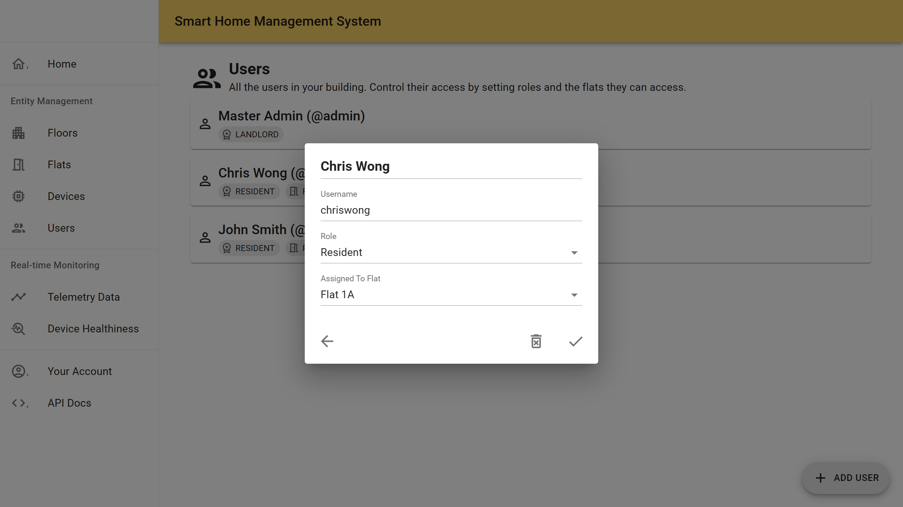
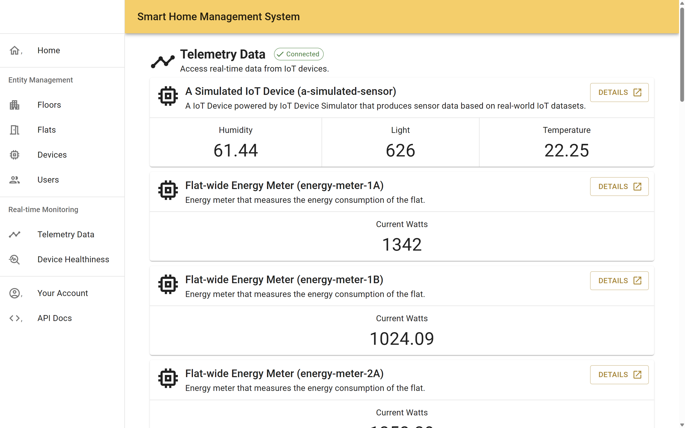
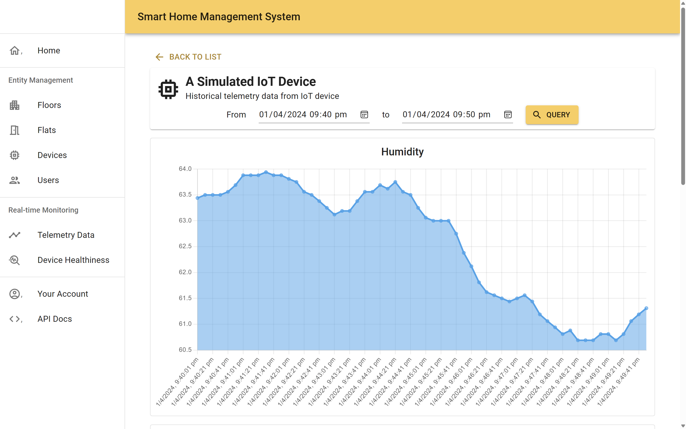
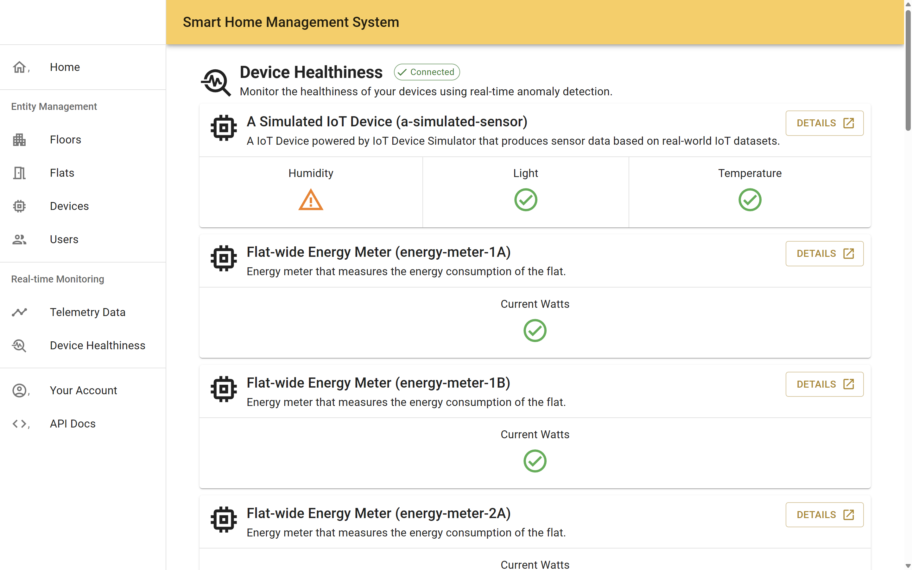
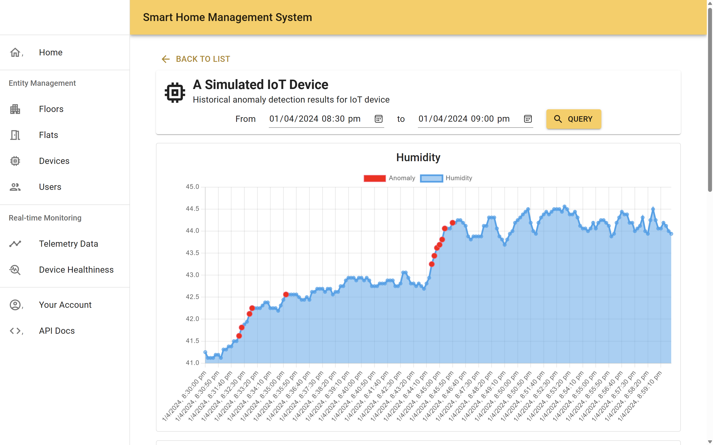

# Smart Home Management System with Real-time Anomaly Detection on Smart Sensor with Machine Learning

**Smart Home Management System** is a full-stack, cloud-based building management solution designed for furnished apartment buildings, allowing the landlord to manage the IoT devices in the building and residents to access IoT devices within their apartment unit.

With real-time anomaly detection on IoT device data using online machine learning techniques, the system can learn the pattern of IoT device data over time and identify potential malfunctioning IoT devices in real time, easing the workload of managing the IoT system while facilitating timely response to anomaly events in the system. 

The system adopts a microservices architecture; all components are containerized using Docker and can be deployed to a Kubernetes cluster using Helm Chart and Terraform Script. Deployment procedures are provided below for running the Smart Home Management System on your own computer.

## Major Features

### Entity Management

Keep track of the real-world objects in the building using the Entity Management feature, which lets you manage all the floors, flats (apartment units), and devices in the building.

*Manage all flats in the apartment building*

*View and update device details*

### User Management

Invite other trusted users to join the system and manage entities in the building by creating a Landlord account for them. In addition, the residents can also access the system, but they only have read-only access to the devices under their flats.

*Have a glance at all the users, their roles, and the flat they are assigned to (if available)*

*Update user details and set their Role to determine their permission in the system*

### Telemetry Data

Keep track of the telemetry data produced by all devices in real-time and query the historical record of the sensor readings.

*Real-time telemetry data for all devices*

*Historical sensor readings within the selected time range*

### Real-time Anomaly Detection

Smart Home Management System monitors all telemetry data that goes through the system and uses online machine learning techniques to identify anomalies in real-time. The detection result for all devices will be immediately updated in the Web UI.

*Real-time anomaly detection results for all devices*

*Historical anomaly detection result for a device within the selected time range*

## Deployment

Two deployment methods have been provided for easy deployment of the Smart Home Management System on your own computer to experience the features of the system.

Kubernetes deployment is the default approach for running the Smart Home Management System and *is recommended for the best experience*. Terraform scripts have been provided to deploy all the system components to your Kubernetes cluster automatically.

If you do not have access to a Kubernetes cluster or you want to quickly spin up a working instance of Smart Home Management System to try it out, you can use Docker Compose.

The instructions for running the Smart Home Management System with either approach are provided below:

- [Deploy Smart Home Management System on Kubernetes using Terraform (Recommended)](./deployment/terraform/README.md)
- [Run Smart Home Management System on your computer using Docker Compose](./deployment/docker-compose/README.md)

## Demo Data

Demo data are available during deployment to illustrate the potential use cases of this system. You can learn more about the demo data [here](./extra-info/DEMO-DATA.md).